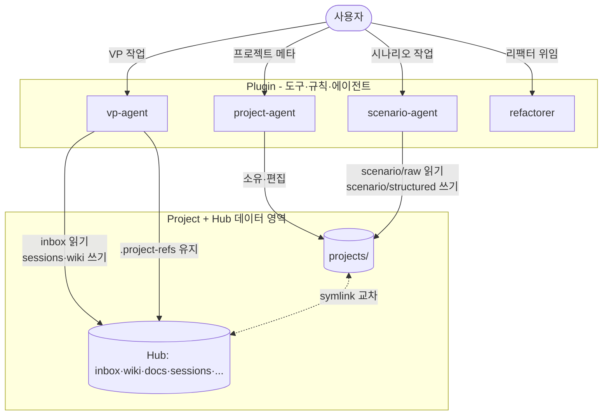

# Agent Registry

Plugin 에서 제공하는 Agent 목록과 상관관계.

## Agent 목록

| Agent | 소유 영역 | 책임 | 트리거 키워드 | 정의 |
|---|---|---|---|---|
| **project-agent** | `projects/` 루트 + `project.yaml` | 프로젝트 생성·메타데이터·수명주기 관리 | 프로젝트, project.yaml, 신규 작품, 라인업 | [project-agent/CLAUDE.md](project-agent/CLAUDE.md) |
| **scenario-agent** | `projects/PROJ_*/scenario/` | 시나리오 raw → structured (아크/시퀀스/씬/비트) 컴파일 | 시나리오, 아크, 시퀀스, 씬, 비트, 각본 | [scenario-agent/CLAUDE.md](scenario-agent/CLAUDE.md) |
| **vp-agent** | Hub 의 VP 영역 (userConfig 로 주입: `inbox_root`·`sessions_root`·`wiki_root`·`docs_root` 등) | VP Supervisor — GO/NO-GO 판정·팀 조율·리스크 관리·데이터 정리·wiki 컴파일·기술 자문 | VP, 모션캡처, MetaHuman, Unreal, OptiTrack, 촬영, LED월, GO/NO-GO, 팀 브리핑, 동기화 | [vp-agent/CLAUDE.md](vp-agent/CLAUDE.md) |
| **refactorer** | 위임 파트 내부만 (소유 영역 없음) | 동작 보존 리팩터링. 크리티컬 이슈는 NEEDS_REVIEW 로 에스컬레이션 | 리팩터, refactor, 정리, cleanup, 코드 정리 | [refactorer/CLAUDE.md](refactorer/CLAUDE.md) |

## 상관관계 다이어그램

Hub 경로는 Plugin 이 하드코딩하지 않음 — 각 Project 가 userConfig 로 주입.

## 호출 규칙

1. 사용자 메시지의 키워드를 위 표와 매칭 → 해당 Agent 의 `CLAUDE.md` 를 먼저 로드
2. 여러 Agent 가 겹치면(예: VP 프로젝트의 시나리오) **project-agent → scenario-agent → vp-agent** 순으로 체이닝
3. 각 Agent 는 자기 소유 영역 밖을 수정하지 않는다 — 필요시 해당 Agent 로 위임

## `projects/` 권한 매트릭스

- project-agent → `project.yaml` 쓰기
- scenario-agent → `scenarios/**` 쓰기
- vp-agent → 읽기만 (Hub 의 `.project-refs/{PROJ}` symlink 경유)

상세: [`../docs/architecture/projects-permissions.md`](../docs/architecture/projects-permissions.md)

## 금지

- ❌ Agent 정의 디렉토리(`agents/{name}/`)에 실제 프로젝트/VP 데이터 저장 — 메타·규칙만 보관
- ❌ 소유 영역 교차 수정 (예: scenario-agent 가 Hub/vp 영역 편집)
- ❌ Hub 경로 하드코딩 — userConfig 변수 사용
